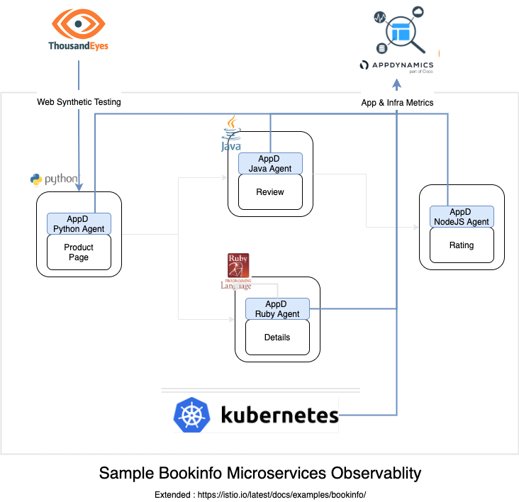
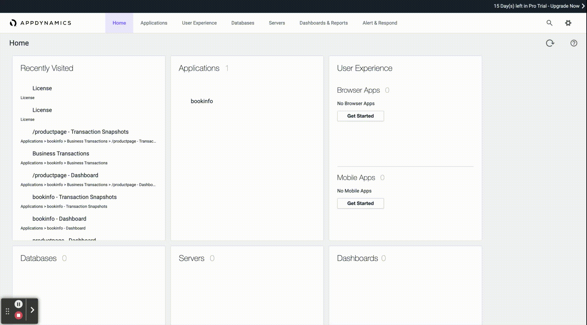
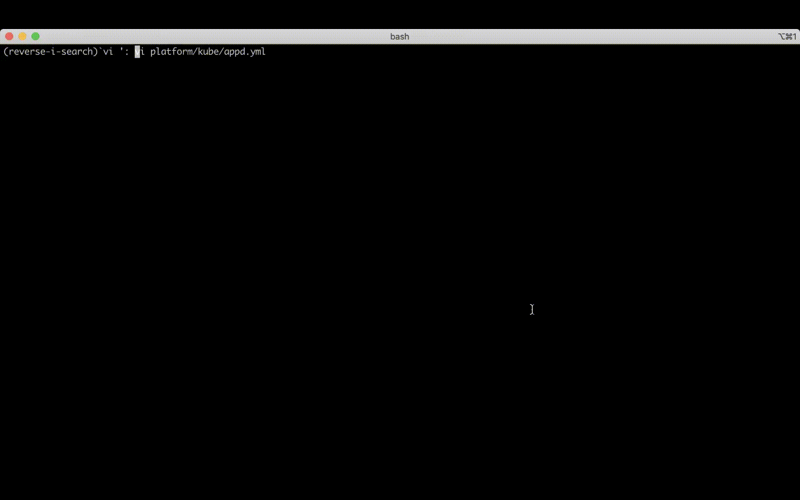

# Cloud Native Sample Bookinfo App Observability

Bookinfo is a sample application composed of four Microservices written in different languages. Application is originally 
created by as part of Istio project to demonstrate various Istio features, See <https://istio.io/docs/examples/bookinfo/>.

Project extends this sample application to demonstrate observability of Cloud Native application using [Cisco AppDynamics](https://www.appdynamics.com/) 
and [ThousandEyes](https://www.thousandeyes.com/). 
Microservices code and docker images area extended to include respective AppDynamics agents that enables [Application Performance Monitoring]() 
for these microservices. [ThousandEyes Web App monitoring](https://www.thousandeyes.com/resources/website-monitoring-use-case) is also configured, that helps understand understand how HTTP, page load and transaction 
performance is affected by the network, and how it stacks up against other similar services.     


## Architecture
Sample book info application is created using 4 polygot microservices & can be deployed on kubernetes cluster. 


 
Microservice details 

| Service Name | Language | Details | 
|--------------|----------|---------|
|Product Page  | Python   | Frontend Microservices service simple web page showing book details, reviews & ratings| 
|Details       | Ruby     | The details microservice contains book information.| 
|Review        | Java     | The reviews microservice contains book reviews. It also calls the ratings microservice.|
|Ratings       | NodeJS   | The ratings microservice contains book ranking information that accompanies a book review.|


Full Stack Observability are enabled for this application (composed of microservices) that monitors user experience, business transaction, 
container, virtual machine, Kubernetes container orchestrator etc.  Each Microservices is instrumented with respective language AppDynamics agent to enable application monitoring data. 
In addition to this [AppD cluster agent for Kubernetes](https://docs.appdynamics.com/21.5/en/infrastructure-visibility/monitor-kubernetes-with-the-cluster-agent) is also setup too to monitor health of Kubernetes and collect metrics and metadata for entire cluster, including every node and container. 

For ProductPage web endpoints the HTTP monitor are added to ThousandEyes that can monitor Response time, Availability and Throughput from 
multiple from different geographic location in world.   


## Setup Application 

1. Pre-requisite
  - Access to working kubernetes cluster and local kubectl cli. [Docker desktop kubernetes](https://docs.docker.com/desktop/kubernetes/), [Minikube](https://minikube.sigs.k8s.io/docs/start/) or [kind](https://kind.sigs.k8s.io/) are some of popular
  options to setup local kubernetes cluster. 
  - [Trial account for AppDynamics](https://www.appdynamics.com/free-trial/)
  - [Trial account for ThousandEyes](https://www.thousandeyes.com/lps/network-monitoring/#lps-free-trial)
  
2. Clone the code to local laptop 
    ```
    git clone https://github.com/CiscoDevNet/bookinfo-cloudnative-sample
    ```
3. Get Access Key and account details from AppDynamics
     

4. Update Access Keys and deploy microservices pods

    i. Modify access-key (base64 encoded), APPDYNAMICS_AGENT_ACCOUNT_NAME (account_name) and APPDYNAMICS_CONTROLLER_HOST_NAME in field
    ```
    echo -n <access-key> | base64 - 
    vi platform/kube/appd.yaml
    ```
    ii. Upload Secret 
    ```
    kubectl apply -f platform/kube/appd.yaml
    ```
    iii. Deploy microservice pods & created services
    ```
    kubectl apply -f platform/kube/bookinfo.yaml
    ```

    
    
    iv. Expose service to internet
    If your cluster have ingress with public internet domain configured use same. 

    Alternative option is to expose service using [ngork](https://ngrok.com/). Service needs to exposed so that ThousandEye can test app. 
    **NOTE**: This is will expose your app to world so please read yourself aware of ngrok. 
    ```
    kubectl run --restart=Never   -t -i --rm   ngrok --image=gcr.io/kuar-demo/ngrok   -- http productpage:9080
    ```

5. Access app, browse various page & login using 'demo' and 'demo' cred. 

   This will start sending metrics to AppdAccount
   

6. Check Application and Infra monitoring details in AppDynamics account 
   

7. Register Web Test on ThousandEyes
   


## AppDynamic Agents Instrumentation of Microservices 
1. Python agent for 'Product Page' 
   [AppDynamics Agent for Python](https://docs.appdynamics.com/21.5/en/application-monitoring/install-app-server-agents/python-agent) is installed using pip package  via [requirements.txt](src/productpage/requirements.txt)

2. Ruby agent for 'Details Service'
   [AppDynamics Agent for Ruby](https://docs.appdynamics.com/display/RUBY/Getting+Started+with+Ruby+Agent) is installed using [Gemfile](src/details/Gemfile) 

3. Java agent for 'Review' Service
   [AppDynamics agent for Java](https://docs.appdynamics.com/21.5/en/application-monitoring/install-app-server-agents/java-agent/install-the-java-agent/install-the-java-agent-in-containers#InstalltheJavaAgentinContainers-init) is inserted using [init-container](platform/kube/bookinfo.yaml). 
   ```
         initContainers:
        - command:
            - cp
            - -r
            - /opt/appdynamics/.
            - /opt/temp
          name: appd-agent
          image: docker.io/appdynamics/java-agent:20.8.0
          volumeMounts:
            - mountPath: /opt/temp
              name: appd-agent-repo
   ```

4. NodeJS 'Rating' Service
   [AppDynamics agent for NodeJS](https://docs.appdynamics.com/21.5/en/application-monitoring/install-app-server-agents/node-js-agent) are installed using npm install in  [package.json](src/ratings/package.json)


5. Agent configuration are set for following [AppDynamics agents configuration Best Practices in kubernetes](https://docs.appdynamics.com/21.5/en/application-monitoring/install-app-server-agents/container-installation-options/instrument-kubernetes-applications-manually/best-practices-to-configure-agents-in-kubernetes) refer [appd.yaml](platform/kube/appd.yaml) and [bookinfo.yaml](platform/kube/bookinfo.yaml) for details. 

## Rebuild Microservices docker images
      Refer : [Build Document](docs/build.md)